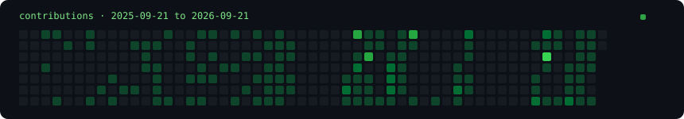

# `ajinkya-awari@github:~$`

**ML Engineer · Published Researcher · Reliable Learning Systems**

I build and study machine-learning systems that are useful beyond a single
metric: reproducible experiments, observable reinforcement-learning behavior,
tool-assisted reasoning, and explanations that help people inspect model
decisions. My public work spans Python, PyTorch, TensorFlow, and research
software.

## Selected work

| Project | What it explores |
| --- | --- |
| [SolomonoffBench](https://github.com/ajinkya-awari/solomonoff-bench) | An empirical benchmark comparing how LLMs compress formally generated sequences of different complexity. |
| [RL autonomous navigation](https://github.com/ajinkya-awari/rl-autonomous-navigation) | A controlled comparison of tabular Q-learning, DDQN, and PPO on stochastic FrozenLake navigation. |
| [Adaptive AI monitoring](https://github.com/ajinkya-awari/adaptive-ai-monitoring) | Lightweight monitors for reward hacking, entropy spikes, and behavioral drift during RL training. |
| [LLM reasoning orchestrator](https://github.com/ajinkya-awari/llm-reasoning-orchestrator) | A neuro-symbolic pipeline that routes exact computation to SymPy instead of relying on model arithmetic. |
| [ChestXplain](https://github.com/ajinkya-awari/xai-medical-imaging) | DenseNet121 chest-X-ray classification paired with Grad-CAM visual explanations. |
| [Market Density Cloud](https://github.com/ajinkya-awari/market-density-cloud) | PCA and clustering views of mixed market data, with an interactive dashboard. |

## Research interests

Reliable ML · reinforcement learning evaluation and monitoring ·
neuro-symbolic reasoning · explainable medical AI · information-theoretic
evaluation · reproducible research software

## Now exploring

How evaluation, observability, and carefully designed tools can make learning
systems more trustworthy without hiding their failure modes.

## Find me

- [GitHub](https://github.com/ajinkya-awari)
- [Research flagship: SolomonoffBench](https://github.com/ajinkya-awari/solomonoff-bench)

## GitHub activity

The heatmap is generated from GitHub's public contribution calendar. It is a
small activity view, not a measure of research quality, and may remain at its
last valid version when GitHub's public page is unavailable.

Profile visuals are local SVGs with no JavaScript, tracking pixels, or external statistics widgets.
