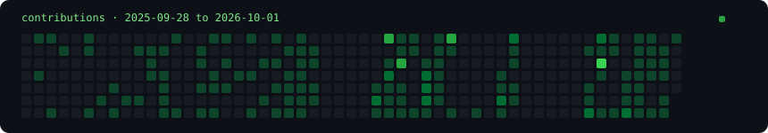

---

I build machine-learning systems that hold up past the demo: reproducible pipelines, leakage-safe evaluation, provenance-first retrieval, and explanations that let people inspect model decisions before trusting them.

My portfolio spans 21 staged projects — each builds a verified synthetic and contract layer first; real data, real models, and deployment are attempted only after an explicit access, licensing, or governance gate is cleared. Every repository shows its actual status, including when that status is "blocked" or "planning-only."

---

## 🔬 Research Areas

| Area | What I build |
| --- | --- |
| **Reliable ML / MLOps** | Reproducible training pipelines, leakage-safe splits, experiment tracking, versioned inference |
| **Biomedical AI** | Graph neural networks for pathology, protein fitness, clinical retrieval, ICD coding |
| **Evaluation & Safety** | Agent trace evaluation, medical-LLM safety contracts, XAI benchmarks |
| **Privacy & Federated Learning** | Differentially-private federated learning, privacy boundary testing |
| **Interpretability** | Mechanistic attribution, activation capture, structured intervention tests |

---

## ⭐ Selected Work

| # | Project | Domain | Status | Verified result |
| ---: | --- | --- | --- | --- |
| 00 | [SolomonoffBench](https://github.com/ajinkya-awari/solomonoff-bench) | LLM evaluation · information theory | Complete with limitations | Benchmark slice closed; complexity-vs-compression analysis complete |
| 05 | [FedScope](https://github.com/ajinkya-awari/fedscope) | Federated learning | Publicly verified | F1 0.78–0.80 (3 seeds); FedAvg / FedProx / FedNova vs. centralized baseline |
| 12 | [GraphGPS-Upgrade](https://github.com/ajinkya-awari/graphgps-upgrade) | Graph learning | Publicly verified | Test ROC-AUC: GPS 0.748 · GIN 0.698 · GCN 0.693 (3 seeds, frozen budget) |
| 04 | [AFBind](https://github.com/ajinkya-awari/afbind) | Structural biology · protein ML | Publicly verified | 37/37 synthetic tests pass on Kaggle CPU kernel |
| 07 | [F2-HistoGNN](https://github.com/ajinkya-awari/f2-histognn) | Computational pathology | Publicly verified | 62 synthetic tests; Kaggle real-data pilot complete (4 models × 3 seeds) |
| 15 | [ESM2-Protein-Fitness](https://github.com/ajinkya-awari/esm2-protein-fitness) | Protein ML | Publicly verified | 87/87 tests; Kaggle kernel run complete |
| 06 | [KnetMiner-LLM](https://github.com/ajinkya-awari/knetminer-llm) | Biomedical graph retrieval | Publicly verified | Release engineering complete; strict per-answer acceptance 0/30 (documented gap) |
| 01 | [T1 MLOps Stack](https://github.com/ajinkya-awari/t1-mlops-stack) | MLOps · inference | Complete with limitations | Training pipeline, experiment tracking, and deployed inference app |
| 19 | [NICE-RAG](https://github.com/ajinkya-awari/-nice-rag) | Clinical NLP · retrieval | Complete with limitations | 151 tests pass; 5 CC BY 4.0 PMC records verified; NICE content gated |

---

## 📁 Full Portfolio — All 21 Projects

> 19 of 21 projects have public repositories. Projects 14 and 20 are planning-stage with no public repo yet.

### Reliable ML & MLOps

| # | Project | Status | Link |
| ---: | --- | --- | --- |
| 00 | **SolomonoffBench** — empirical LLM sequence-compression benchmark across varying Kolmogorov complexity | Complete with limitations | [→](https://github.com/ajinkya-awari/solomonoff-bench) |
| 01 | **T1 MLOps Stack** — end-to-end training pipeline, experiment tracking, and deployed inference app | Complete with limitations | [→](https://github.com/ajinkya-awari/t1-mlops-stack) |
| 02 | **T2 XAI Triple** — Grad-CAM, SHAP, and Integrated Gradients on NIH ChestX-ray14 (mean IoU 0.1289) | Complete with limitations | [→](https://github.com/ajinkya-awari/xai-medical-imaging-project-02) |
| 03 | **AgentTrace** — evaluation harness for LLM agent tool-call traces, sycophancy and reasoning-effort probing | Implementation complete; provider gated | [→](https://github.com/ajinkya-awari/agentrace) |
| 12 | **GraphGPS-Upgrade** — GPS vs. GCN/GIN ablation, frozen 30-epoch budget, Tesla T4 (ROC-AUC 0.748) | Publicly verified | [→](https://github.com/ajinkya-awari/graphgps-upgrade) |

### Biomedical & Protein Intelligence

| # | Project | Status | Link |
| ---: | --- | --- | --- |
| 04 | **AFBind** — AlphaFold2 structure substitution benchmark for protein–ligand affinity prediction | Publicly verified | [→](https://github.com/ajinkya-awari/afbind) |
| 06 | **KnetMiner-LLM** — evidence-grounded biomedical graph retrieval, leakage-safe HGT evaluation | Publicly verified | [→](https://github.com/ajinkya-awari/knetminer-llm) |
| 07 | **F2-HistoGNN** — nuclei-graph benchmark scaffold for LUAD/LUSC histology classification | Publicly verified | [→](https://github.com/ajinkya-awari/f2-histognn) |
| 15 | **ESM2-Protein-Fitness** — protein mutation fitness prediction built on ESM2 embeddings | Publicly verified | [→](https://github.com/ajinkya-awari/esm2-protein-fitness) |
| 18 | **OmicsGraph** — governance-first pipeline contracts for single-cell omics graph learning | Synthetic scope verified | [→](https://github.com/ajinkya-awari/omicsgraph) |

### Clinical Systems & Safety

| # | Project | Status | Link |
| ---: | --- | --- | --- |
| 08 | **ClinicalBERT-ICD** — leakage-safe ICD-9 multi-label scaffold, LoRA vs. full fine-tuning (171 tests) | Synthetic release; real-data gated (DUA) | [→](https://github.com/ajinkya-awari/clinicalbert-icd) |
| 09 | **NHSCopilot-Eval** — evaluation harness for NHS-facing AI copilot workflows (33 public tests) | Complete with limitations (synthetic scope) | [→](https://github.com/ajinkya-awari/-nhscopilot-eval) |
| 10 | **PubMedQA-LoRA** — QLoRA fine-tuning vs. zero-shot on PubMedQA evidence classification | Synthetic scope verified | [→](https://github.com/ajinkya-awari/pubmedqa-lora) |
| 11 | **MedLLM-Safety** — provider-free synthetic safety contracts for medical-LLM evaluation (63 tests) | Synthetic scope verified | [→](https://github.com/ajinkya-awari/medllm-safety) |
| 13 | **ClinVision** — auditable image-to-text prototype on licence-cleared clinical imaging data | Synthetic scope verified | [→](https://github.com/ajinkya-awari/clinvision) |
| 14 | **CausalClinical** — causal-inference benchmark design for MIMIC-III treatment-effect estimation | Planning stage · external approval required | — |
| 19 | **NICE-RAG** — citation-first NICE guideline retrieval with provenance-first contracts (151 tests) | Complete with limitations | [→](https://github.com/ajinkya-awari/-nice-rag) |

### Privacy & Federated Learning

| # | Project | Status | Link |
| ---: | --- | --- | --- |
| 05 | **FedScope** — FedAvg / FedProx / FedNova vs. centralized baseline (F1 0.78–0.80, 3 seeds) | Publicly verified | [→](https://github.com/ajinkya-awari/fedscope) |
| 17 | **PrivacyFL-DP** — synthetic contract layer for differentially-private federated learning (23 tests) | Synthetic scope verified | [→](https://github.com/ajinkya-awari/privacyfl-dp) |

### Interpretability & Theoretical Systems

| # | Project | Status | Link |
| ---: | --- | --- | --- |
| 16 | **Mech-Interp** — deterministic toy contracts for activation capture, attribution, and interventions | Synthetic scope verified | [→](https://github.com/ajinkya-awari/mech-interp) |
| 20 | **AIXI-Complexity** — planned benchmark: AIXI-style vs. LLM agents across known-complexity environments | Planning stage | — |

---

## 🛠 Technologies

---

## 📐 How I Work

Every project follows the same engineering discipline:

- **Contracts before code** — write the acceptance tests first; implementation proves the contract
- **Synthetic before real** — local fixtures verify the full pipeline before any restricted data or provider is touched
- **Explicit gates** — external data, models, and APIs are gated; no action is taken without a recorded authorization
- **Honest status** — every repository shows what is verified, what is gated, and what is planning-only
- **Provenance-first** — metadata is attached before splitting or processing; citations are deterministic and bounded

---

## 🎯 Current Focus

Opening the real-data and provider gates on the six projects where synthetic contracts are already complete:

| Project | Next gate |
| --- | --- |
| ClinicalBERT-ICD | MIMIC-III DUA approval |
| NICE-RAG | NICE AI licence + Groq evaluation |
| AgentTrace | Provider API authorization |
| CausalClinical | MIMIC-III DUA + causal design review |
| PubMedQA-LoRA | GPU compute + full fine-tuning run |
| AIXI-Complexity | Environment design + compute plan |

---

## 📊 GitHub Activity

Activity calendar generated from GitHub's public contribution data. No JavaScript, no tracking pixels, no external statistics widgets.

---

## 📬 Contact

- **GitHub** — [github.com/ajinkya-awari](https://github.com/ajinkya-awari)
- **Hugging Face** — [huggingface.co/ajinkya1807](https://huggingface.co/ajinkya1807)
- **Kaggle** — [kaggle.com/ajinkya1225](https://www.kaggle.com/ajinkya1225)
- **Email** — ajinkya18072001@gmail.com

---

## 📄 Published Research

The portfolio projects above extend prior peer-reviewed work. The foundational study was published in 2023:

| Paper | Venue | DOI | Portfolio extension |
| --- | --- | --- | --- |
| **Transfer Learning for Plant Disease Detection** — comparative study across VGG16, ResNet50, and EfficientNetB0 on the PlantVillage dataset; empirical analysis of two-phase fine-tuning against frozen feature extraction | IJARSCT 2023 | [10.48175/IJARSCT-9156](https://doi.org/10.48175/IJARSCT-9156) | Extended in [Transfer-Learning-Plant-Disease](https://github.com/ajinkya-awari/Transfer-Learning-Plant-Disease) (Mar 2026) and underpins the GNN agricultural disease propagation work |

---

<strong>Earlier experiments (pre-portfolio, Mar–Apr 2026)</strong>

These predate the 00–20 portfolio numbering. They form the empirical foundation the main portfolio builds on — algorithm, RL, CV, GNN, and interpretability experiments run before the structured campaign began.

| Project | What it explores |
| --- | --- |
| [Transfer-Learning-Plant-Disease](https://github.com/ajinkya-awari/Transfer-Learning-Plant-Disease) | VGG16 / ResNet50 / EfficientNetB0 comparison on PlantVillage — extension of published IJARSCT 2023 paper |
| [GNN Agricultural Networks](https://github.com/ajinkya-awari/gnn-agricultural-networks) | GCN, GraphSAGE, GAT for disease propagation modelling; extends the published plant disease research |
| [ChestXplain](https://github.com/ajinkya-awari/xai-medical-imaging) | DenseNet121 + Grad-CAM on chest X-ray multi-label classification — predecessor to T2 XAI Triple |
| [Curious Adaptive Planner](https://github.com/ajinkya-awari/curious-adaptive-planner) | Curiosity-augmented Value Iteration with adaptive policy arbitration; bounded optimality in hybrid RL agents |
| [RL Autonomous Navigation](https://github.com/ajinkya-awari/rl-autonomous-navigation) | Q-learning, DDQN, and PPO on stochastic FrozenLake — convergence and sample efficiency analysis |
| [Adaptive AI Monitoring](https://github.com/ajinkya-awari/adaptive-ai-monitoring) | Reward-hacking, entropy-spike, and KL-divergence drift monitors for RL training; PID hardware loop |
| [LLM Reasoning Orchestrator](https://github.com/ajinkya-awari/llm-reasoning-orchestrator) | Neuro-symbolic routing: SymPy for exact computation, reducing hallucination on engineering problems |
| [Algorithm Complexity Visualizer](https://github.com/ajinkya-awari/algorithm-complexity-visualizer) | Empirical Big-O validation via exact operation counting, log-log regression, and interactive web visualizer |
| [NN Optimizer Study](https://github.com/ajinkya-awari/nn-optimizer-study) | SGD / Adam / RMSprop / Adagrad / L-BFGS on CIFAR-10 — convergence, gradient norms, loss landscape |
| [IoT Anomaly Detection](https://github.com/ajinkya-awari/iot-anomaly-detection) | LSTM and Transformer autoencoders vs. Isolation Forest on 5 industrial fault types with attention viz |
| [Advanced DSA Patterns](https://github.com/ajinkya-awari/Advanced-DSA-Patterns) | 60+ algorithmic patterns with automated tests — production-grade implementations |

---

Built and maintained by Ajinkya Awari · 21-project ML portfolio · 2026

